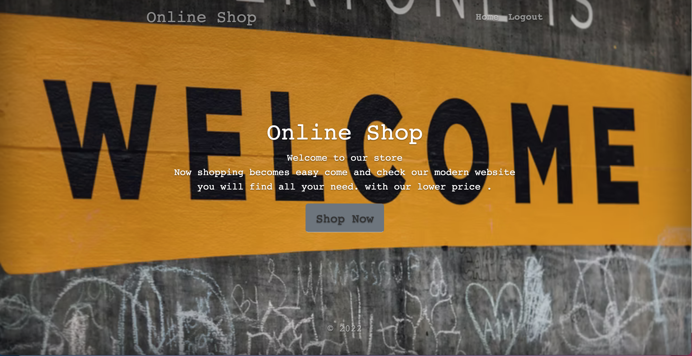
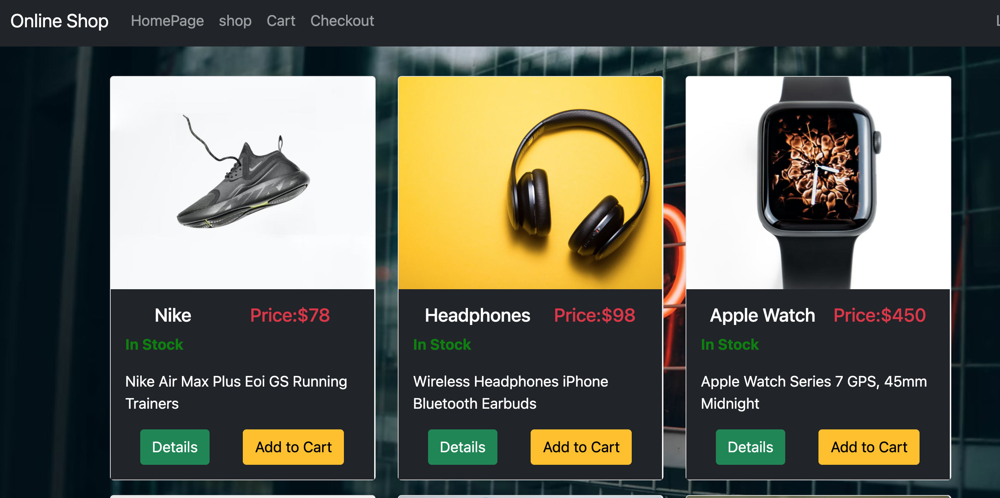

# About The Project

## This is an online shop sample that offers features such as products, shopping carts, an option to leave reviews on products, and checkout

---

## Built With

- [Node.js](https://nodejs.org/en/)
- [Express.js](https://expressjs.com/)
- [Passport.js](https://www.passportjs.org/)
- [Bootstrap](https://getbootstrap.com/)
- [Javescript](https://www.javascript.com/)

---

# Getting Started

- Follow instructions below to have a copy of this project up and running

## Prerequisites

- Clone the repo

  - https://github.com/AlhakeemALI/project-2-node.js.git

- Nodejs, a JavaScript runtime that lets you run applications outside the browser
- NPM, a package manager for Nodejs software packages
  (Comes with Node)
  - npm install
- MongoDB installation
- Create .env file

# Features

- User can create account and sign in
  -User can add and remove products to shopping cart
- User can leave a review on certain products and the review can only be deleted by user

# MVP / User Stories

- As a user I can register my information so I can login and logout when I want and use the app
- As a user I can find the products I like and add to my cart
- As a user I can read product details and read other users reviews
- As a user I can delete items from my cart
- As a user I can delete my comment and post a comment
- As a user I can logout from my account

## MVP / Admin Stories

- As an admin I can add products to the website
- As an admin I can edit product details such as price, product name, design and availability
- As an admin I can remove certain comments from products
- As an admin I can edit the front page and theme of the website

## Stretch Goals

- As a user I want the ability to process my order and receive notifications about the status of my order
- As a user I want to receive an email about upcoming sales and events in the store
- As a user I want to have the ability to reset my password and change my personal information
- As an admin I want to add additional admins to take charge of the website
- As an admin I would like the ability to restructure my users schema to obtain more flexibility with the website
- As an admin I want to maintain payment information so the user can process payment
